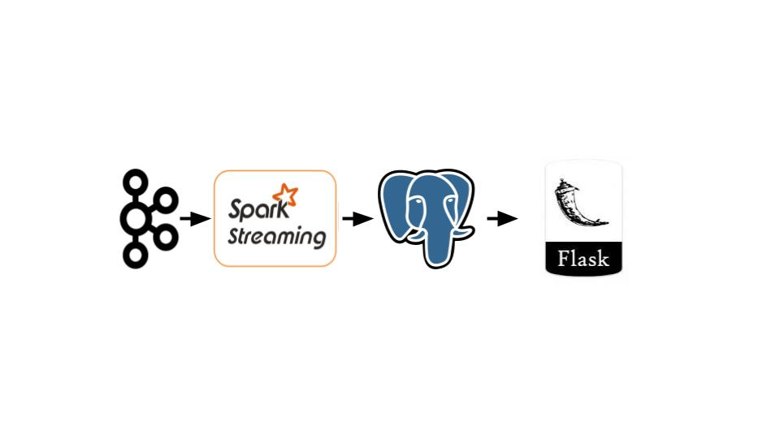

# 2018-Insight Data Engineering Project
# GamerStream
Real-time analytics in online games.

# What is the purpose, and most common use cases?
Online games provide a challenging volume and velocity of data. From this information, gaming companies can gain valuable insights on how to enhance the user experience, retain users and grow player base.

One example of this is adaptive rewards. A game's difficulty must be finely balanced to have the player challenged and not overly punished. However less-skilled and dim-witted players may be frustrated and quit the game early. One way to retain these players to monitor their challenges in real time and reward them appropriately. This functionality requires large streams of gaming data to be monitored in real time, which is fortunately a possibility in the modern social and mobile gaming scene.

Specifically, we can capture a window of player performance and deaths (in-game). Given this information, it will then be up to the game designer to decide on an appropriate reward to retain the player. 

Another example would capture streams for both the victor and loser in the game. Specifially, reward the loser with an item that is tailored to defeat the victor. To enable this functionality, the data for both players must crosstalk in the stream, which presents more complexity to test the durability of the pipeline.

The streamed data may be stored for further large-scale batch processing.

Additional features may be added to the pipelin. One possibility is a anomaly detection for player death count, which may point to game bugs.

# Technologies
Ingestion technology: Kafka

Streaming technologies: Spark streaming

Database: Cassandra

WebUI: Dash

# Proposed architecture
Streaming architecture

# Data sources
DOTA 2 match repository: 
http://academictorrents.com/details/1a0c5736bb54610ad00a45306df2b33628301409

This repository consists of DOTA 2 game match data up to March 2016. Each match consists of players, with the following time-stamped events:
Skill, Level, Items, Runes, Gold, Damage Ticks, Kills

Altough the data set is sampled per match (~1 sample/30 min), the time stamped events can be processed to form a stream of events (~1 event/second/player). DOTA 2 had a peak of 658,729 concurrent players on 4/20/2018, which will roughly translate to ~600k events/second. 

# Primary Engineering Challenges, Specifications, and Constraints
By analyzing a stream of +500,000 concurrent player events, this project reflects the real-life engineering challenges of streaming gaming analytics. 

Our success in this engineering challenge will be gauged with the following specifications/metrics:
* Fixed : Dashboard deliverable
* Variables: Concurrent users, Avg events/second
* Metrics: Latency (Source --> Dashboard), Database accuracy (post-stream)
    
Constraints: Limit # machines and type
    

